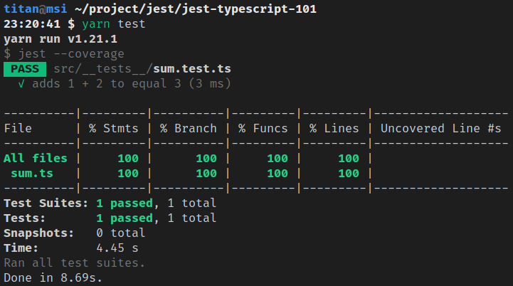

# Jest + TypeScript：建置測試環境

[Source 原文](https://titangene.github.io/article/jest-typescript.html)


## 與原文不同
test 改用了 
```javascript
import sum from '@/sum';
```
引入 Module

修改了 tsconfig.json
```json
{
    "compilerOptions": {
        ...
        "paths": {
            "@/*": [
                "./src/*"
            ]
        },
    }
}
```

及 jest.config.js
```js
module.exports = {
    ...
    moduleNameMapper: {
        '^@/(.*)$': '<rootDir>/src/$1'
    }
}

```


TypeScript 是 JavaScript 的 typed superset，提供強大的型別檢查系統，讓你在編譯時期就能即時發現錯誤，而不是到了 runtime 才發生未知的 bug。上次介紹了 [Jest + Babel 的測試環境建置](https://titangene.github.io/article/jest-build-test-env.html)，這次來介紹 Jest + TypeScript 的測試環境建置過程。

其他 Jest 相關文章可參閱 [其代原文作者 Jest 系列文章](https://titangene.github.io/tags/jest/)。

下面來介紹如何建置 Jest + TypeScript 的測試開發環境。

# 建立開發環境

## 建立 npm 專案

```
$ npm init -y
```

## 安裝 TypeScript

```
$ npm install -D typescript
```

## 安裝與 Node.js 和 TypeScript 相關的環境

* [`ts-node`](https://github.com/TypeStrong/ts-node)：Node.js 的 TypeScript 執行環境和 REPL，且支援 source map
  * 不用手動執行** **`tsc`** **編譯 TypeScript 檔案，就能直接像是使用** **`node`** **指令那樣，直接透過** **`ts-node`指令來編譯並執行 TypeScript 檔案
* [`nodemon`](https://github.com/remy/nodemon)：提供 watch 模式的** **`node`
  * 當** **`nodemon`** **檢測到指定目錄中的檔案有變更時，就會重新啟動 Node 應用程式
* [`@types/node`](https://www.npmjs.com/package/@types/node)：Node.js 的型別定義檔

```
$ yarn add -D ts-node nodemon @types/node
```

或

```
$ npm install -D ts-node nodemon @types/node
```

## 安裝與 Jest 和 TS 相關的環境

* [`jest`](https://github.com/facebook/jest)：JavaScript 測試框架
* [`ts-jest`](https://github.com/kulshekhar/ts-jest)：用於 Jest preprocessor 的 TypeScript preprocessor
  * 支援 Jest 的 source map
  * 可讓你使用 Jest 來測試用 TypeScript 寫的專案
  * 支援 TS 的所有功能，包括型別檢查
* [`@types/jest`](https://www.npmjs.com/package/@types/jest)：Jest 的型別定義檔

```
$ yarn add -D jest ts-jest @types/jest
```

或

```
$ npm install -D jest ts-jest @types/jest
```

## 設定 `package.json`

在** **`package.json`** **加上下面內容：

```
{
  "scripts": {
    "start": "ts-node src/main.ts",
    "dev": "nodemon --watch 'src/**/*.ts' --exec ts-node src/main.ts",
    "build": "tsc",
    "test": "jest --coverage"
  }
}
```

## 設定 `jest.config.js`

Jest 的預設是可以不用配置任何檔案就能執行測試，但 Jest 的預設是使用 Babel 來處理** **`.ts`** **(和** **`.tsx`** **) 檔案** **^[[1]](https://titangene.github.io/article/jest-typescript.html#fn1)^ ，而 Babel 不會對** **`.ts`** **檔案進行編譯處理，所以就不會進行型別檢查。而** **`ts-jest`** **就能幫你處理 TS 該做的這些事。

> 在** **[Babel7 or TypeScript | ts-jest](https://kulshekhar.github.io/ts-jest/user/babel7-or-ts)** **這篇文章內有提到為何不要用** **`@babel/preset-typescript`，而要用** **`ts-jest`** **的原因。
>
> 所以若要開發 TypeScript，不建議使用 Babel，建議用** **`tsc`** **來編譯 TypeScript。

為了要使用** **`ts-jest`** **來 transpile TypeScript，請執行以下指令來建立 Jest 的配置檔案** **`jest.config.js`：

```
$ npx ts-jest config:init
```

此指令建立的** **`jest.config.js`** **檔案內容如下：

```
module.exports = {
  preset: 'ts-jest',
  testEnvironment: 'node',
};
```

但我自己自訂了一些配置：

* `coverageDirectory`：Jest 輸出的 coverage 檔案要放在哪個目錄
  * 預設：`undefined`
* `preset`：設定 preset
  * 預設：`undefined`
  * preset 應指向 root 目錄上具有** **`jest-preset.json`** **或** **`jest-preset.js`** **檔案的 npm 模組
* `testEnvironment`：用於測試的測試環境
  * 預設：`"jsdom"`** **(類似瀏覽器的環境)
  * 若要建置 node service，可用** **`"node"`** **來使用類似 node 的環境
* `testRegex`：Jest 只執行 match 此 pattern 的測試檔案
  * 預設：`(/__tests__/.*|(\\.|/)(test|spec))\\.[jt]sx?$`
    * 即在** **`__tests__`** **目錄內的** **`.js`、`.jsx`、`.ts`** **和** **`.tsx`** **檔，以及帶有** **`.test`** **或** **`.spec`** **後綴的任何檔案，例如：`sum.test.ts`** **或** **`sum.spec.ts`
  * Jest 會用** **`testRegex`** **配置的 pattern 來嘗試 match 測試檔案的絕對路徑

```
module.exports = {
  coverageDirectory: "coverage",
  preset: 'ts-jest',
  testEnvironment: "node",
  testRegex: "(/__tests__/.*|(\\.|/)(test|spec))\\.tsx?$"
};
```

> 更多 Jest 配置詳情可參閱** **[Configuring Jest · Jest](https://jestjs.io/docs/en/configuration)。

# 設定 `tsconfig.json`

自己手動建立** **`tsconfig.json`：

```
{
  "compilerOptions": {
    "target": "es6",
    "module": "commonjs",
    "outDir": "dist",
    "strict": true,
    "sourceMap": true,
    "esModuleInterop": true
  }
}
```

當然你也可以用** **`tsc --init`** **指令來建立** **`tsconfig.json`。

> 更多** **`tsconfig.json`** **配置詳情可參閱** **[TypeScript: TSConfig Reference - Docs on every TSConfig option](https://www.typescriptlang.org/tsconfig)。

# 寫範例程式碼

```
// src/sum.ts
type sumType = (a: number, b: number) => number;
const sum: sumType = (a, b) => a + b;
export default sum;
```

```
// src/main.ts
import sum from './sum';

console.log(sum(1, 2));
```

執行** **`main.js`：

```
$ yarn start
yarn run v1.21.1
$ ts-node src/main.ts
3
Done in 4.71s.
```

或

```
$ npm run start

> jest-typescript-101@1.0.0 start /home/titan/project/jest/jest-typescript-101
> ts-node src/main.ts

3
```

# 建立測試

```
// src/__tests__/sum.test.ts
import sum from '../sum';

test('adds 1 + 2 to equal 3', () => {
  // Arrange
  let x: number = 1, y: number = 2;
  let expected: number = 3;

  // Act
  let actual: number = sum(x, y);

  // Assert
  expect(actual).toBe(expected);
});
```

# 執行測試

```
$ yarn test
```

或

```
$ npm run test
```

測試通過：



資料來源：

* [ts-jest](https://kulshekhar.github.io/ts-jest/)
* [ts-node](https://github.com/TypeStrong/ts-node)
* [nodemon](https://github.com/remy/nodemon)
* [Getting Started · Jest](https://jestjs.io/docs/en/getting-started)
* [Jest CLI Options · Jest](https://jestjs.io/docs/en/cli)
* [Configuring Jest · Jest](https://jestjs.io/docs/en/configuration)
* [TypeScript: TSConfig Reference - Docs on every TSConfig option](https://www.typescriptlang.org/tsconfig
